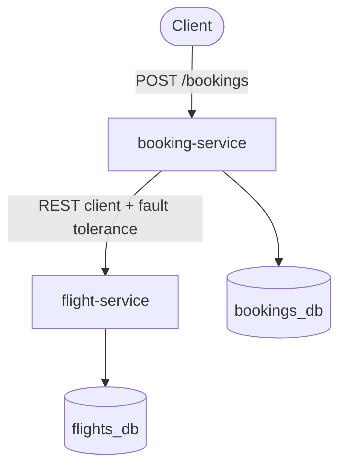
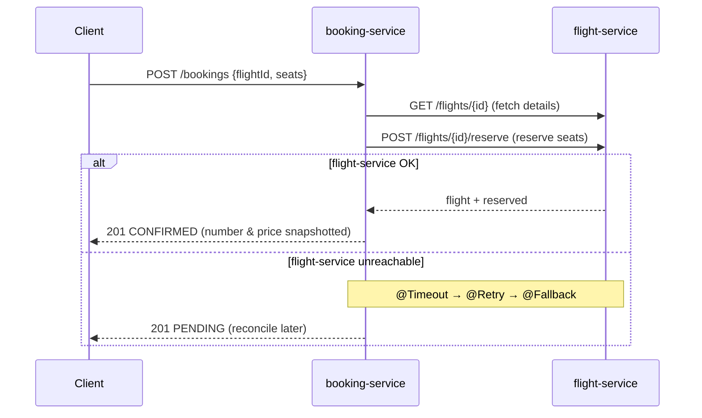

# Quarkus Skybooker

Two **Quarkus** microservices in the flights domain, built to be compiled to a
**GraalVM native** image and run in **Docker**. A `booking-service` calls a
`flight-service` (request/reply over REST) to check availability and reserve
seats, with fault tolerance so a booking degrades gracefully when the flight
service is unavailable.

> Backend portfolio project. Runs end-to-end from a clone — dev mode auto-starts
> PostgreSQL (Quarkus Dev Services), or run the whole stack with Docker Compose.

---

## Features

- **JAX-RS** annotation-driven REST APIs (request/reply JSON)
- **Authentication** — **JWT** (SmallRye JWT): login issues a signed token; the
  token is **propagated** on the internal call so every hop is authenticated (zero trust)
- **Service-to-service call** — booking → flight via the **MicroProfile REST Client**
- **Fault Tolerance** — `@Timeout`, `@Retry`, `@Fallback` on the inter-service call
- **CDI** — `@Inject`, `@ApplicationScoped`, `@Qualifier`, `@RequestScoped`, `@Observes`
- **MicroProfile Config** — `@ConfigProperty` with **DEV / TEST / PROD** profiles
- **Persistence** — Hibernate ORM with Panache, **PostgreSQL per service**
- **Database migrations** — **Flyway** owns the schema in every environment;
  Hibernate only validates (dev/prod parity)
- **Monitoring** — SmallRye **Health** (incl. a dependency probe) + Micrometer **Prometheus** metrics
- **Testing** — **JUnit 5 + RestAssured** (+ Mockito for the REST client)
- **GraalVM native + Docker** — native-ready, multi-service `docker compose`

---

## Architecture



Each service owns its **own PostgreSQL database** (database-per-service). The only
coupling between them is the HTTP call from booking-service to flight-service.

### Booking flow



---

## Tech stack

| Concern | Choice |
|---------|--------|
| Language / Build | Java 25, Maven (wrapper) |
| Framework | Quarkus 3.38 |
| Native | GraalVM 25 (`native-image`) |
| APIs | Quarkus REST (JAX-RS) |
| Security | SmallRye JWT (MicroProfile JWT) |
| Inter-service | MicroProfile REST Client (+ Bearer token propagation) |
| Resilience | SmallRye Fault Tolerance |
| Persistence | Hibernate ORM + Panache, PostgreSQL 18 |
| Migrations | Flyway (schema owned by migrations, Hibernate validates) |
| Config | MicroProfile Config (profiles) |
| Observability | SmallRye Health, Micrometer + Prometheus |
| Testing | JUnit 5, RestAssured, Mockito |
| Ops | Docker, Docker Compose |

---

## Getting started

### Prerequisites
- **GraalVM 25** (JDK 25 + `native-image`) — set as `JAVA_HOME`
- Docker (for PostgreSQL, whether via Dev Services or Compose)

### Run in dev mode (recommended for development)
Each service auto-starts its own PostgreSQL via **Dev Services** — no DB setup.

```bash
# terminal 1
cd flight-service && ./mvnw quarkus:dev      # http://localhost:8701

# terminal 2
cd booking-service && ./mvnw quarkus:dev     # http://localhost:8702
```

Live coding is on: edit code and it reloads automatically. Dev UI at
`http://localhost:8701/q/dev/`.

### Run the whole stack with Docker

```bash
(cd flight-service && ./mvnw package -DskipTests)
(cd booking-service && ./mvnw package -DskipTests)
docker compose up --build
```

- flight-service → http://localhost:8701
- booking-service → http://localhost:8702

### Try it

The APIs require a JWT — log in first, then send the token as a Bearer header.

```bash
# 1. log in (demo / demo123) and capture the token
TOKEN=$(curl -s -X POST http://localhost:8702/auth/login \
  -H 'Content-Type: application/json' \
  -d '{"username":"demo","password":"demo123"}' | sed -n 's/.*"token":"\([^"]*\)".*/\1/p')

# 2. book — the token is propagated on to flight-service
curl -X POST http://localhost:8702/bookings \
  -H "Authorization: Bearer $TOKEN" \
  -H 'Content-Type: application/json' \
  -d '{"flightId":1,"passengerName":"Ada Lovelace","seats":2}'

# without a token you get 401
curl -i http://localhost:8701/flights
```

---

## API overview

**flight-service** (`:8701`)

| Endpoint | Purpose |
|----------|---------|
| `GET /flights` | list flights |
| `GET /flights/{id}` | one flight |
| `GET /flights/{id}/availability?seats=n` | availability check |
| `POST /flights/{id}/reserve` | reserve seats (atomic) |

All `/flights` endpoints require a valid Bearer token.

**booking-service** (`:8702`)

| Endpoint | Purpose | Auth |
|----------|---------|------|
| `POST /auth/login` | log in, returns a JWT | public |
| `POST /bookings` | create a booking (calls flight-service) | Bearer token |
| `GET /bookings` / `GET /bookings/{id}` | list / fetch bookings | Bearer token |

**Both services** — health and metrics live on a separate **management port**
(flight `9001`, booking `9002`), not the public app port.

| Endpoint | Purpose | Auth |
|----------|---------|------|
| `:9001|9002/q/health/live`, `/q/health/ready`, `/q/health` | health | public |
| `:9001|9002/q/metrics` | Prometheus metrics | public |

---

## How the key concepts show up

- **Authentication (JWT, zero trust)** — `POST /auth/login` on booking-service
  validates credentials and signs a JWT with an RSA private key. Both services are
  set to **`@Authenticated`** and verify tokens with the shared public key. When
  booking-service calls flight-service, a `ClientHeadersFactory` **propagates the
  Bearer token**, so the internal hop is authenticated too — no service trusts the
  network. (Authorization/roles are intentionally left out to keep it simple.)
- **Fault tolerance** — `FlightGateway` wraps the flight-service call with
  `@Timeout(2s)`, `@Retry`, and `@Fallback`. Network failures degrade the booking
  to `PENDING`; business errors (404/409) `abortOn`/`skipOn` the fallback and
  surface as proper statuses.
- **Config profiles** — `application.properties` uses `%dev` / `%test` / `%prod`
  prefixes: dev/test use Dev Services PostgreSQL; prod reads a real database and
  the flight-service URL from environment variables.
- **CDI** — a `@Qualifier` (`@Standard`) selects a `PricingStrategy`; a
  `@RequestScoped` `RequestContext` tags logs with a per-request id; `@Observes`
  reacts to a custom `BookingCreatedEvent` and the startup event.
- **Monitoring** — health and metrics are served on a separate **management port**
  (flight `9001`, booking `9002`) so they aren't exposed on the public app port. A
  custom `@Readiness` check reports whether flight-service is reachable (probing its
  management port); custom counters (`bookings_created_total`,
  `flights_seats_reserved_total`) appear at `/q/metrics`.

---

## Testing

```bash
./mvnw test    # per service — JUnit 5 + RestAssured, PostgreSQL via Dev Services
```

booking-service tests use `@InjectMock @RestClient` (Mockito) to control
flight-service, covering the happy path, the **fallback → PENDING** path, and
error propagation — without flight-service actually running.

---

## GraalVM native build

Compile a service to a native executable (needs GraalVM `native-image`):

```bash
cd flight-service
./mvnw package -Dnative
# or build a native container image:
./mvnw package -Dnative -Dquarkus.native.container-build=true
```

Native images start in tens of milliseconds and use a fraction of the memory of
the JVM — the main reason to pair Quarkus with GraalVM.

---

## Notes

- **Schema management** — **Flyway** owns the schema and runs migrations at startup
  in **every** environment (dev/prod parity); Hibernate is set to `validate` and
  only checks the entities against the migrated schema. This mirrors real
  production and catches entity/schema drift at startup.
- **Ports** — dev: flight `8701`, booking `8702`. In containers flight listens on
  `8801` and booking on `8802`, mapped back to host `8701` / `8702`. Health and
  metrics are on a separate **management port** — flight `9001`, booking `9002` —
  in every environment.
- **Auth is demo-grade** — the login user (`demo`/`demo123`) and the RSA keypair in
  `src/main/resources` are for local development only. A real deployment would use a
  proper identity provider (OIDC/Keycloak) and keys from a secret store, and would
  add authorization (roles) on top of authentication.
